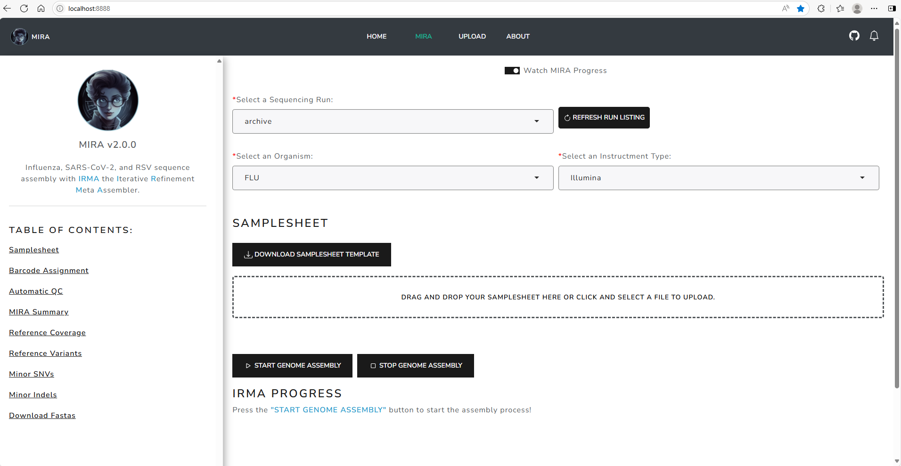

# MIRA Shiny

Portable, Interactive Application for High-Quality Influenza, SARS-CoV-2 and RSV Genome Assembly, Annotation, and Curation

## QUICK START

### Requirements

- Git version >= 2.21.0
- Docker version >= 18
- Docker Compose Version >= 1.29

#### (1) Clone this respitory

```
https://github.com/CDCgov/MIRA.git
```

#### (2) Navigate to `MIRA` folder 

```
cd MIRA
```

#### (3) Check out `mira_shiny` branch

```
git checkout mira_shiny 
```

#### (4) Open `docker-compose-cdcgov.yml` file and edit the file to link the data source to run `mira` container

- In the example below, a local `FLU_SC2_SEQUENCING` folder is mounted for testing purposes. Please change **/home/snu3/Github/FLU_SC2_SEQUENCING** to your local **FLU_SC2_SEQUENCING** directory.

```bash
x-mira-image:
  &mira-image
  cdcgov/mira-dev:shiny
  
x-data-volume:
  &data-volume
  type: bind
  source: /home/snu3/Github/FLU_SC2_SEQUENCING
  target: /data  

services:
  mira_shiny:
    container_name: mira_shiny
    image: *mira-image
    restart: always
    ports:
      - 8888:8050
    volumes:
      - *data-volume
    entrypoint: ["/bin/bash", "-c", "/MIRA/dashboard-kickoff"]
    
  mira_api:
    container_name: mira_api
    image: *mira-image
    depends_on:
      - mira_shiny
    restart: always
    ports:
      - 5000:5000
    volumes:
      - *data-volume
    entrypoint: ["/bin/bash", "-c", "/MIRA/api-kickoff"]
```

#### (5) Start up the `mira` container

```bash
docker compose -f docker-compose-cdcgov.yml up -d 
```

**`-d`**: run the container in detached mode
  
For more information about the docker-compose syntax, see [docker-compose up reference](https://docs.docker.com/engine/reference/commandline/compose_up/)

#### (6) Interact with MIRA Dashboard on localhost:8888 with your preferred web browser



#### (7) Interact with MIRA API on localhost:5000 with your preferred web browser

The API Server: ```http://localhost:5000/fasta```

For example:

```
http://localhost:5000/fasta?seq_run=rsv-all-types
```

**Required**:

* `seq_run`: A sequencing run folder in the **FLU_SC2_SEQUENCING** directory

__IMPORTANT NOTES__: The API query will look for an amended consensus fasta file in a given `<sequencing run>` subfolder of the **FLU_SC2_SEQUENCING** directory.


