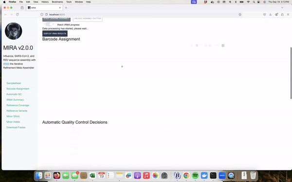
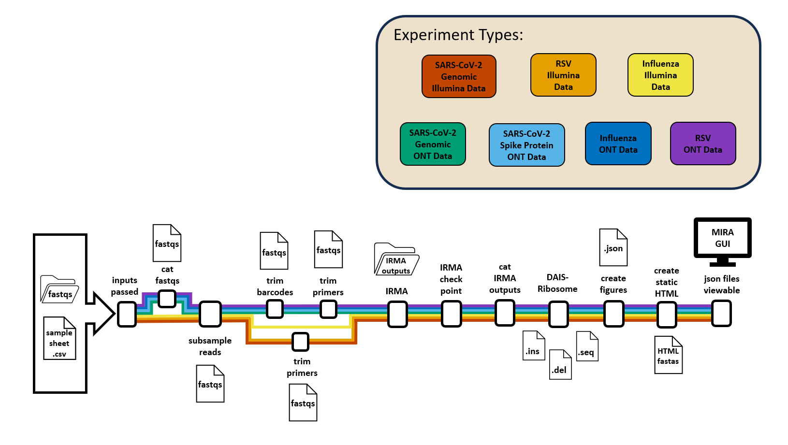

# MIRA: Portable, Interactive Application for High-Quality Influenza, SARS-CoV-2 and RSV Genome Assembly, Annotation, and Curation


  

**General disclaimer** This repository was created for use by CDC
programs to collaborate on public health related projects in support of
the [CDC
mission](https://www.cdc.gov/about/divisions-offices/index.html). GitHub
is not hosted by the CDC, but is a third party website used by CDC and
its partners to share information and collaborate on software. CDC use
of GitHub does not imply an endorsement of any one particular service,
product, or enterprise.

------------------------------------------------------------------------

  

# Get Started with MIRA Today!

*[Quick start on Ubuntu
OS](https://cdcgov.github.io/MIRA/articles/quick-start-ubuntu.md)*



# Overview

**MIRA** is a bioinformatics pipeline that assembles Influenza genomes,
SARS-CoV-2 genomes, the SARS-CoV-2 spike-gene and RSV genomes when given
the raw fastq files and a samplesheet. MIRA can assemble reads from both
Illumina and OxFord Nanopore sequencing machines. *Coming soon, it will
automate sequence submission to NCBI’s
[**Genbank**](https://www.ncbi.nlm.nih.gov/genbank/),
[**BioSample**](https://www.ncbi.nlm.nih.gov/biosample/), and
[**SRA**](https://www.ncbi.nlm.nih.gov/sra/), as well as
[**GISAID**](https://gisaid.org/) using
[SeqSender](https://cdcgov.github.io/seqsender/).*



------------------------------------------------------------------------

## Which MIRA is right for you?

All versions of MIRA process raw sequencing reads into consensus genomes
using the same pipeline and quality control. All versions create an
interactive quality report and multi-fastas ready for public database
submission.

### Running MIRA with Docker Desktop (MIRA-GUI)

MIRA-GUI is the most popular choice for laboratory scientists. It runs
on a local computer and is ideal for users who are not comfortable using
the command line.

Computational Requirements:

- A minimum of 16GB of memory is required. \>=32GB is recommended.
- A minimum of 8 CPU cores. 16 are recommended.

Skill Needed:

- Ability to install software on a computer.

Key features:

- **No command line needed!**
- Easy to use Graphical User Interface (GUI).

To run MIRA with Docker Desktop you can get started
[here](https://cdcgov.github.io/MIRA/articles/mira-dd-getting-started.md).

### Running MIRA on the command line (MIRA-CLI) with Docker

MIRA-CLI runs on a local computer from the command line. It is ideal for
users who are familiar with running scripts from a terminal and are
interested in automating MIRA analyses into local pipelines.

Computational Requirements:

- A minimum of 16GB of memory is required. \>=32GB is recommended.
- A minimum of 8 CPU cores. 16 are recommended.
- **Administrative privileges are required on a Windows operating system
  *to run linux*.**
- A linux/unix (includes MacOS\*) operating system is required.
  - This software **does work** on Apple’s M-chip based OS, *however we
    have observed intermittent instability issues.*
  - If you are using a Mac, [go to Mac Getting
    Started.](https://cdcgov.github.io/MIRA/articles/mira-cli-mac-getting-started.md)

Skill Needed:

- Ability to navigate your command line and run commands.

Key features:

- Interactive and sharable HTML reports.

To run MIRA-CLI you can get started with our [Quick Start for Ubuntu
instructions](https://cdcgov.github.io/MIRA/articles/quick-start-ubuntu.md),
[PC
instructions](https://cdcgov.github.io/MIRA/articles/getting-started.md)
or [Mac
instructions](https://cdcgov.github.io/MIRA/articles/mira-cli-mac-getting-started.md).

### Running MIRA-NF with Nextflow

MIRA-NF runs on a high performing computing (HPC) cluster or in a cloud
computing platform. It is ideal for users who have access to an HPC and
want to process a large volume of samples.

Computational Requirements:

- Access to an HPC or cloud computing platform.

Skill Needed:

- Familiarity with analyzing data in HPC and cloud computing platforms.
- Strong understanding of command line interface.

Key features:

- Able to run large data sets *without the need for subsampling.*
- Interactive and sharable HTML reports.

### To run MIRA-NF you can get started by cloning the [MIRA-NF Repo](https://github.com/CDCgov/MIRA-NF)!

------------------------------------------------------------------------

## Test your MIRA Setup

### Download + format with Docker (recommended)

``` bash
# Linux / macOS
docker run --rm -v "$PWD:/data" cdcgov/mira-test-data:0.0.1
```

Output appears in `./mira_run/`

### Download + format without Docker (copy/paste)

Requires [`sra-tools`](https://github.com/ncbi/sra-tools)
(`conda install -c bioconda sra-tools`).

``` bash
mkdir -p mira_run/fastqs && cd mira_run && echo "sample_id,sample_type" > samplesheet.csv
for p in SRR37675411:f58cd412 SRR37675412:f133a406 SRR37675413:e91ea59e SRR37675414:d969e179 SRR37675415:ba21bd1f SRR37675416:ad336cc2 SRR37675417:89bb6967 SRR37675418:81ae9ee5 SRR37675419:73ceed0e SRR37675420:6796f13d SRR37675421:314ac5ba SRR37675422:240aa994 SRR37675423:239e44e6 SRR37675424:0dca4b84 SRR37675425:046435d3 SRR37675426:03b02807; do
    srr=${p%:*}; sid=${p#*:}
    prefetch $srr -O sra && \
    fasterq-dump sra/$srr --split-files -O fastqs && \
    gzip fastqs/${srr}_1.fastq fastqs/${srr}_2.fastq && \
    mv fastqs/${srr}_1.fastq.gz fastqs/${sid}_R1.fastq.gz && \
    mv fastqs/${srr}_2.fastq.gz fastqs/${sid}_R2.fastq.gz && \
    echo "$sid,Test" >> samplesheet.csv
done && rm -rf sra
```

Resulting `mira_run/`:

    mira_run/
    ├── fastqs/          # {hash}_R1.fastq.gz + {hash}_R2.fastq.gz per isolate
    └── samplesheet.csv  # sample_id,sample_type
