# Running MIRA on an "M-chip" Mac with Podman Desktop

## Install Podman Desktop
[Podman](https://podman-desktop.io/) is an open source replacement for Docker that allows 
you to run software inside an isolated “container image” 
on your computer with all of that application’s needed dependencies. 
Make sure to install the version for your operating system.

* [Click here to go to download website.](https://podman-desktop.io/downloads)
Download the "Apple silicon" version
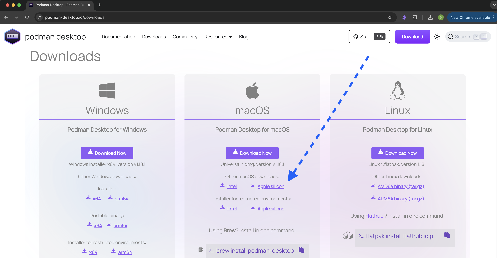
Open the installer file and drag the "Podman Desktop" icon into the Applications folder
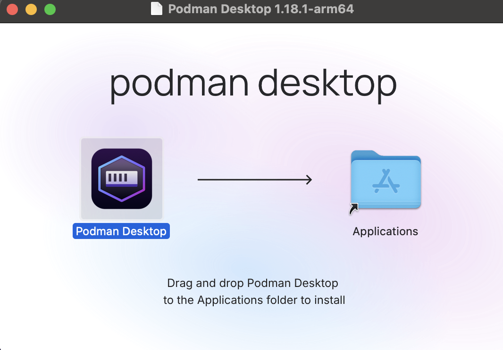

* Open Podman Desktop from the Finder in the Applications folder.
    * _The first time you open the program you may receive a warning that is was 
    downloaded from the internet. Click 'Open'_

    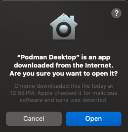{width="50%"}

* Unselect "kubectl CLI" from "Choose extensions to include"  and click "Start onboarding".
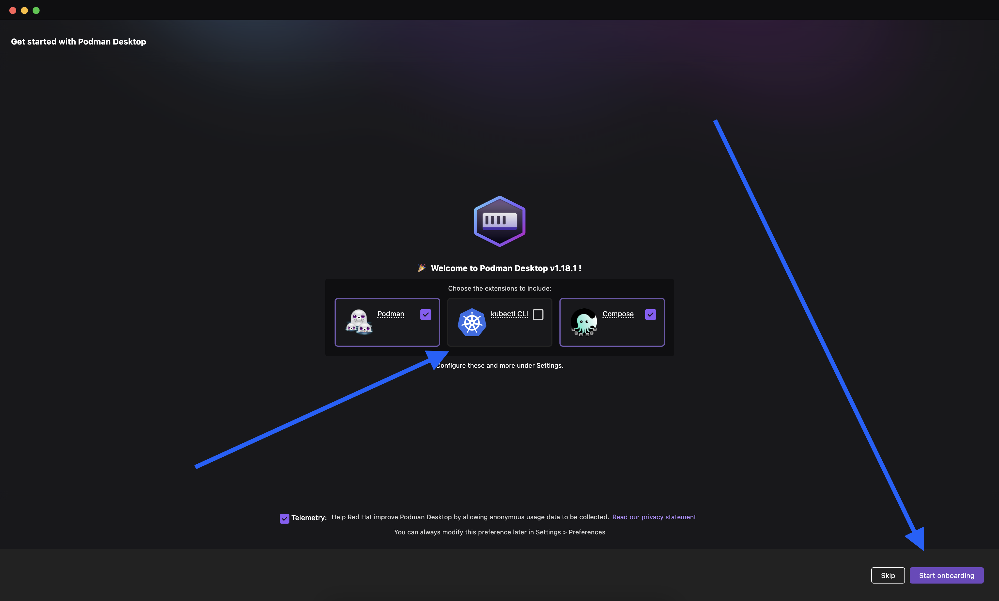
* Click next to install Podman itself (this is the underlying software Podman Desktop needs).
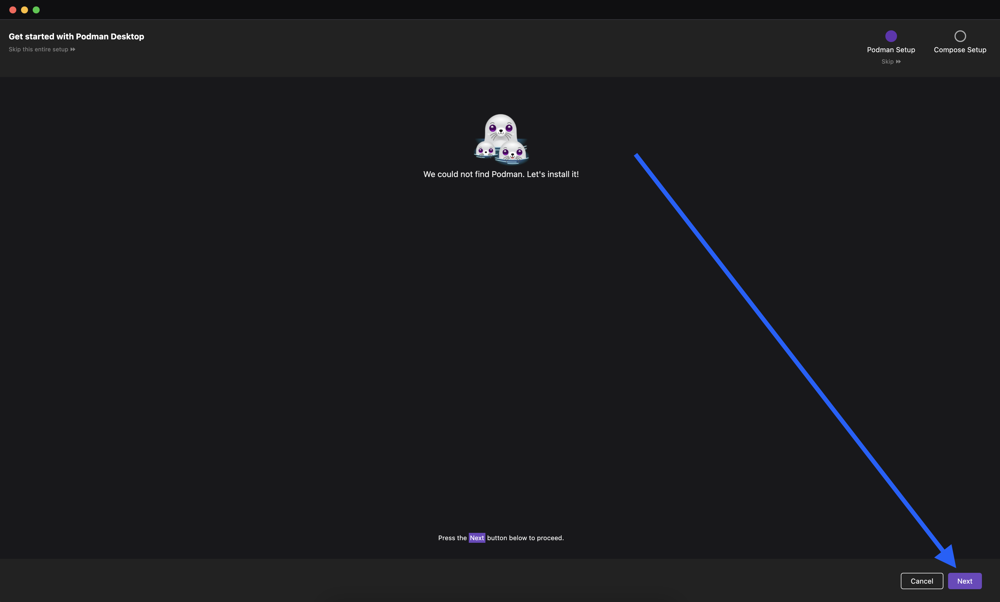
* Click 'yes' in the box that pops up and follow the installation instructions.
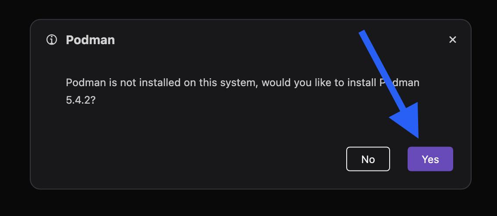
* Click 'Next' on the screen displaying "Podman has been set up correctly" and then "Next"
on the following screen displaing "We could not find any Podman machine."
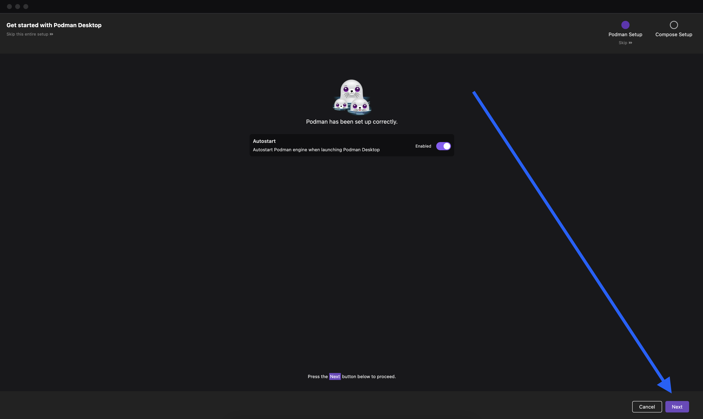 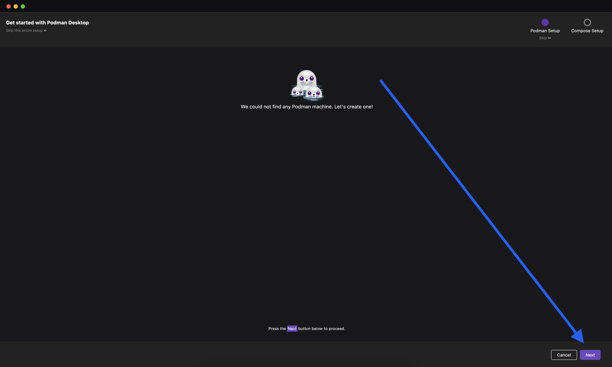
* On the "Create a Podman machine" screen, increase CPU(s) and Memory to about 80% of the maximum
available on your machine. Leave the other options at their defaults. Click "Create". This may take several minutes.
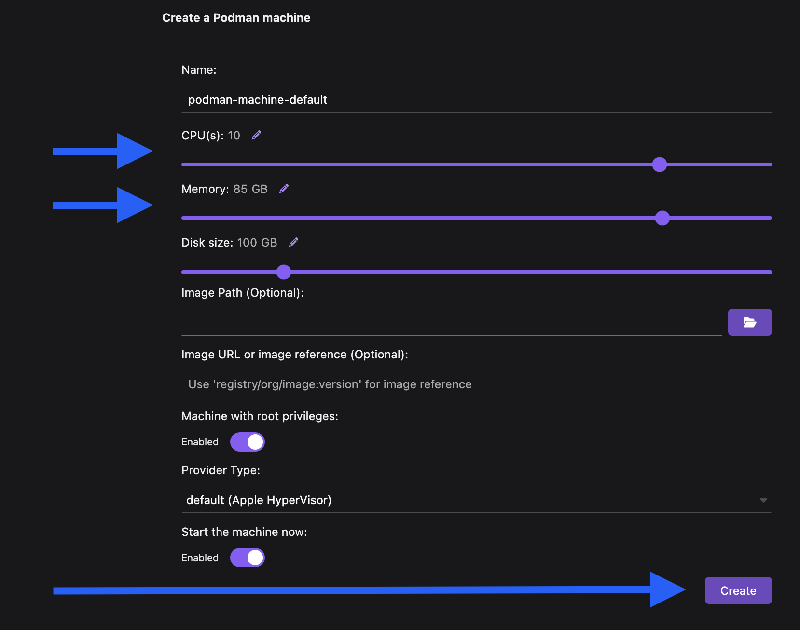
* When complete, you will see a "Podman installed" screen, click "Next".
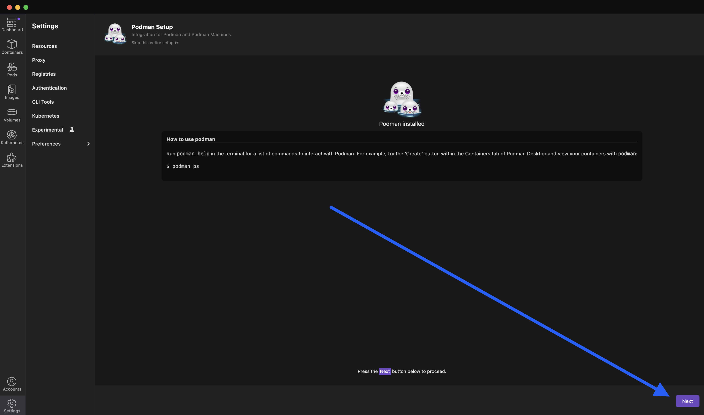
* You will now see the Podman Desktop home screen. Click on "images" on the far left panel.
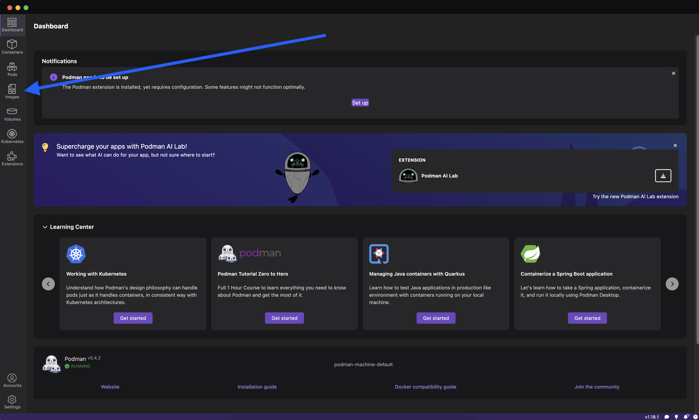
* Click on "Pull" in the top right
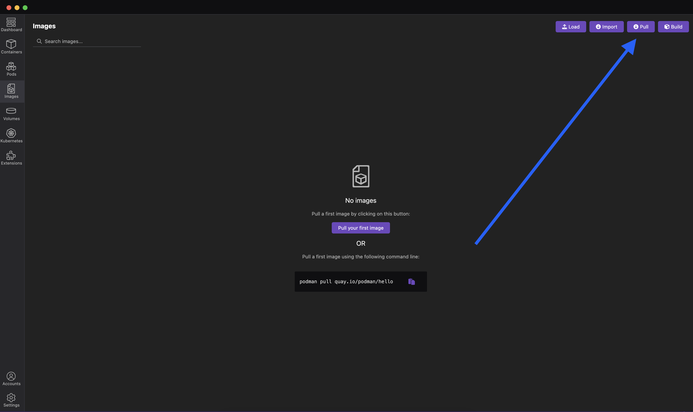
* In the "Image to Pull" box, type `docker.io/cdcgov/mira:v2.0.0` and click "Pull image".
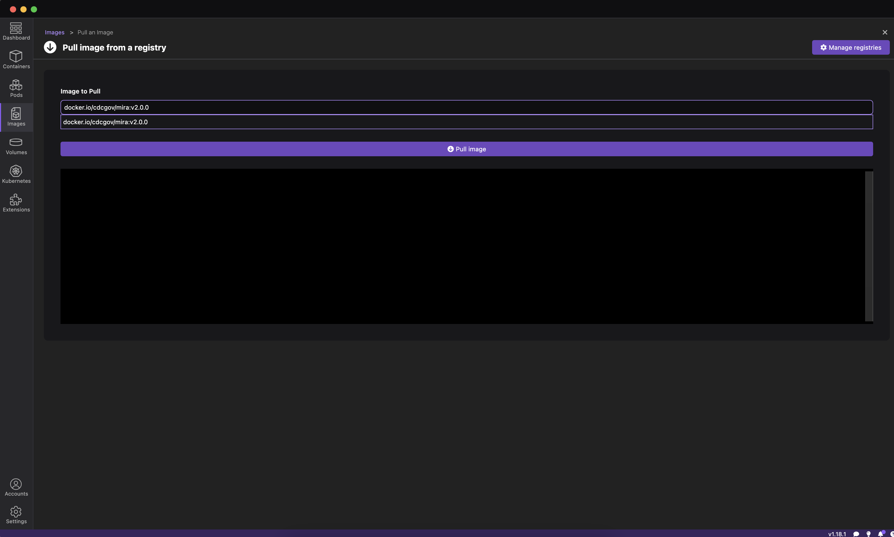
* When the install completes, click "Done".
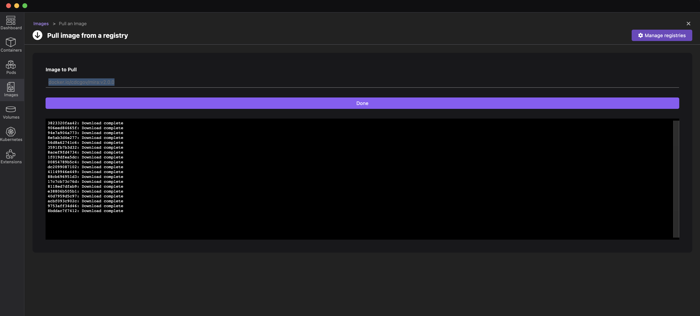
* Click the run arrow to the right of the MIRA image.
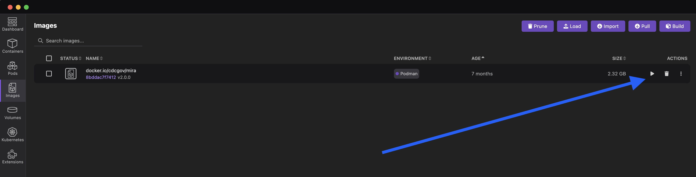
* Name the container "MIRA-v2.0.0". Under "Volumes", click the Folder icon and select the folder
where you save sequencing-runs, in this case "MIRA_NGS". On the right side "Path inside the container",
type `/data`. Leave the other options at their defaults. Click "Start Container".
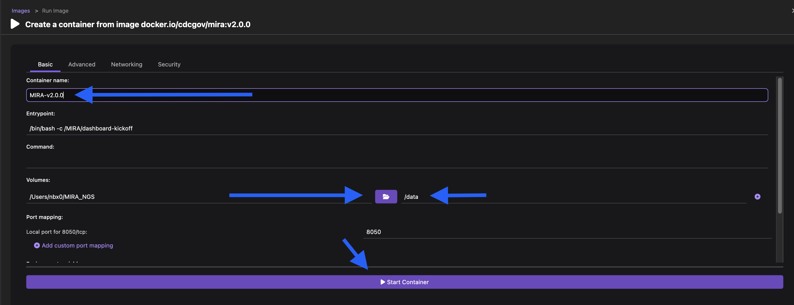
* In the top right corner, click on the small icon of a box with an arrow in it to launch MIRA
in your browser.
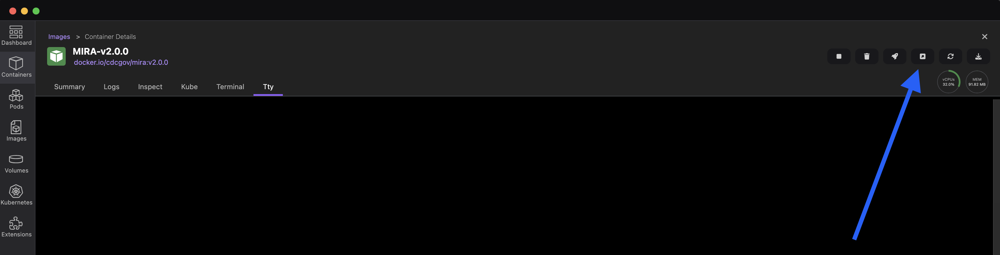

**Congratulations!** You are now ready to produce high quality genomes with MIRA! 

## Test your MIRA Setup
    
- [Click here to download tiny test data from ONT Influenza genome and SARS-CoV-2-spike - 40Mb](https://centersfordiseasecontrol.sharefile.com/d-s839d7319e9b04e2baba07b4d328f02c2)
- [Click here for the above data set + full genomes of Influenza and SARS-CoV-2 from Illumina MiSeqs - 1Gb](https://centersfordiseasecontrol.sharefile.com/d-s3c52c0b25c2243078f506d60bd787c62)
- unzip the file and find two folders:
    1. `tiny_test_run_flu`
    2. `tiny_test_run_sc2`
- move these folders into `MIRA_NGS`

## Next Steps

[Run MIRA in Podman Desktop with Illumina Data](running-mira-dd-illumina.html#run-genome-assembly-with-mira)

[Run MIRA in Podman Desktop with Oxford Nanopore Data](running-mira-dd-ont.html#run-genome-assembly-with-mira)

