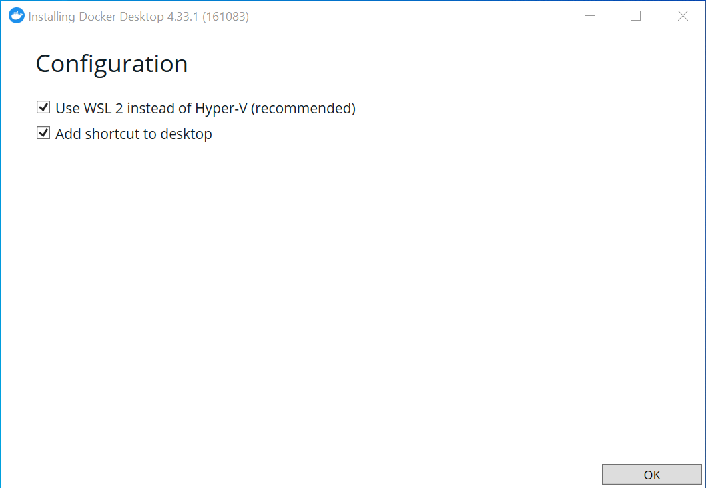
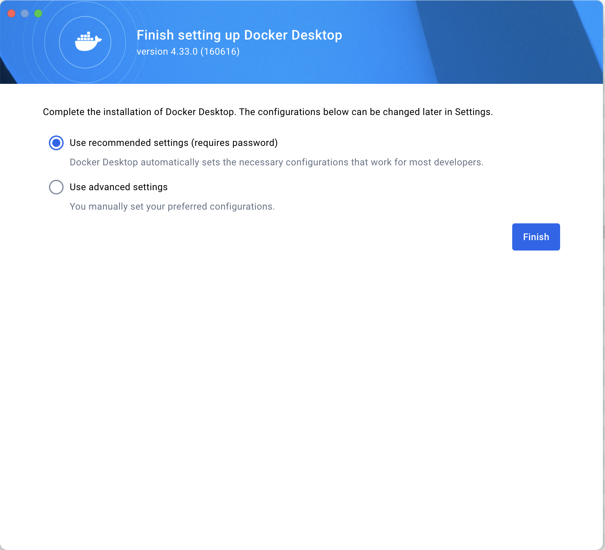
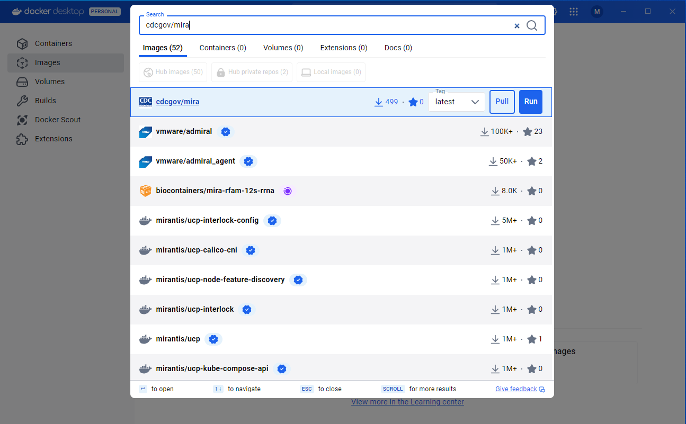
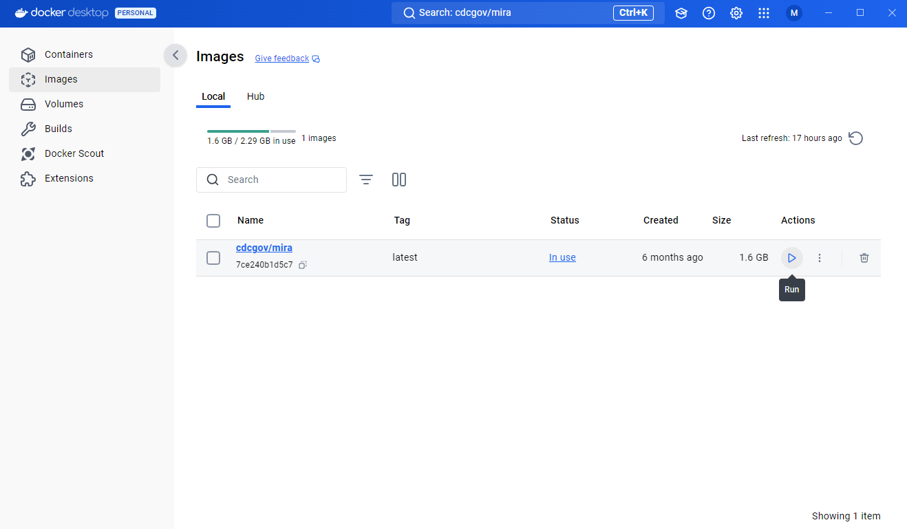
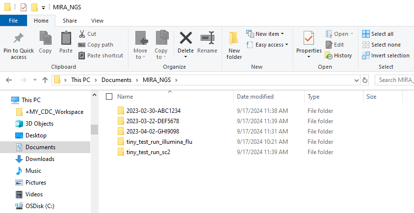
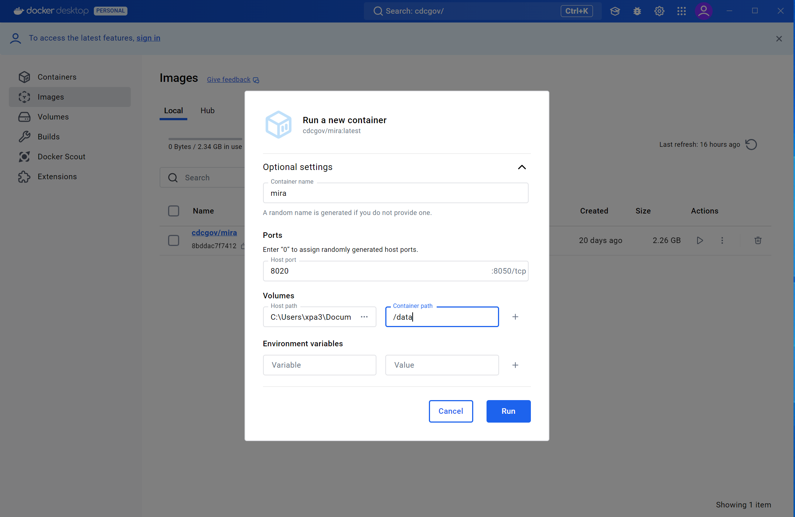
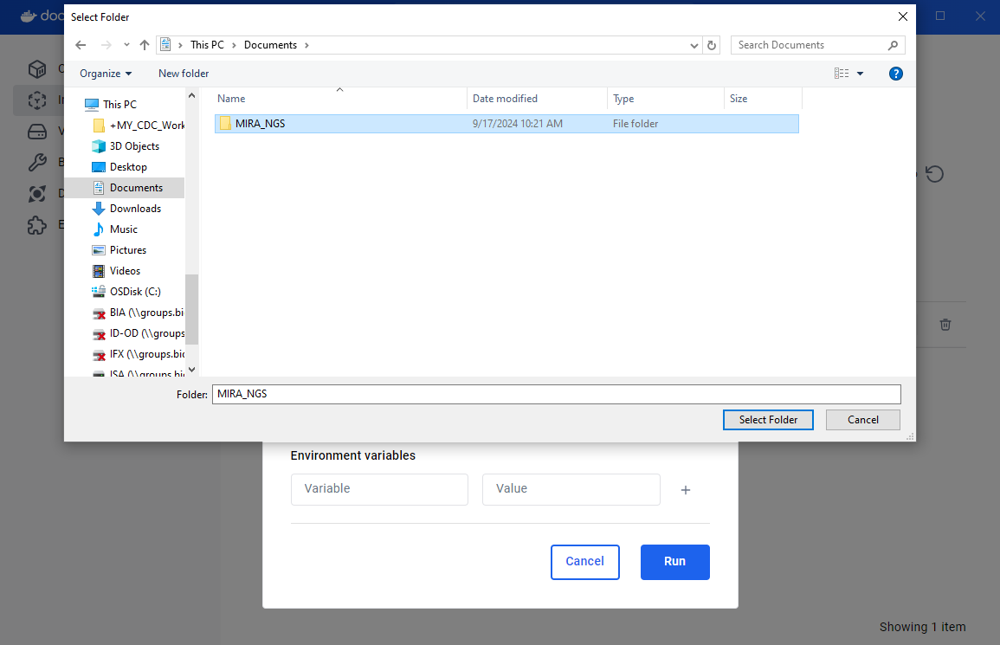
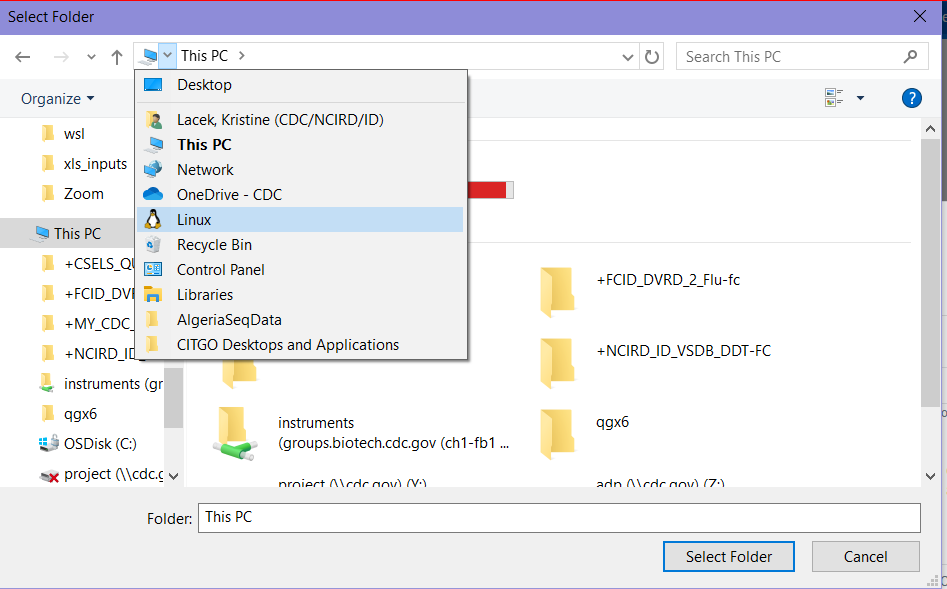

# Running MIRA through Docker Desktop.

## [Install Docker Desktop](https://www.docker.com/products/docker-desktop/)
Docker allows you to run software inside an isolated "container image" on your computer with all of that application's needed dependencies. Make sure to install the version for your operating system.

- [Windows](https://desktop.docker.com/win/main/amd64/Docker%20Desktop%20Installer.exe?utm_source=docker&utm_medium=webreferral&utm_campaign=dd-smartbutton&utm_location=header)
- [Mac-Intel](https://desktop.docker.com/mac/main/amd64/Docker.dmg?utm_source=docker&utm_medium=webreferral&utm_campaign=dd-smartbutton&utm_location=module)
- [Mac-AppleChip](https://desktop.docker.com/mac/main/arm64/Docker.dmg?utm_source=docker&utm_medium=webreferral&utm_campaign=dd-smartbutton&utm_location=module)
- [Linux](https://docs.docker.com/desktop/linux/install/)


After installing Docker Desktop, double click on the app to open it. If it is your first time using Docker Desktop, you will be asked to agree to the terms of use. 

## Setting Up Docker Desktop using PC

When setting up the configuration for a Windows computer, we recommend using WSL 2 on the back-end and adding shortcuts to you desktop. 


<hr>

## Setting Up Docker Desktop using Mac

When setting up the configuration for a Windows computer, we recommend using the default settings that allow Docker Desktop to automatically set the necessary configuration.



<hr>

## Pull MIRA Image within Docker Desktop

* In the search bar at the top of the Docker Desktop App type in cdcgov/mira. Once the image has come up, check that the tag is set to latest
and click the 'pull' button.



* MIRA's single image is about 2 GB and will take a couple of minutes to pull to the images area. Once docker has finished downloading the image, you should see it under your images tab. 


<hr>


## Install MIRA Container

* On your computer, create a folder named "MIRA_NGS". This is where you will put the data that you would like to analyze with MIRA. We will be mounting the container to this folder.



* In Docker Desktop, navigate to the images tab and press the run button. 


### Provide the Settings for the Container

* Open the 'Optional settings' section. The container settings should be filled out as seen in the screenshot below.

  

 * You will need to provide a name for the container. "MIRA" is the obvious choice!
 * Set the "Host Port" to 8020
 * Under Volumes click the "Host Path" box and find and select your "MIRA_NGS" folder.
  
 
 **If you would like your "Host Path" to be a folder within your linux environment, use the drop down in your file browser to find it. See the screenshot below for an example.** 
 
 
 
 * Under Volumes you will make the "Container Path" type in '/data'.

## Test your MIRA Setup

#### Download test data + format with Docker (recommended)
##### Linux / macOS

```bash
docker run --rm -v "$PWD:/data" cdcgov/mira-test-data:0.0.1
```

Output appears in `./mira_run/`


## Next Steps

[Run MIRA in Docker Desktop with Illumina Data](running-mira-dd-illumina.html)

[Run MIRA in Docker Desktop with Oxford Nanopore Data](running-mira-dd-ont.html)