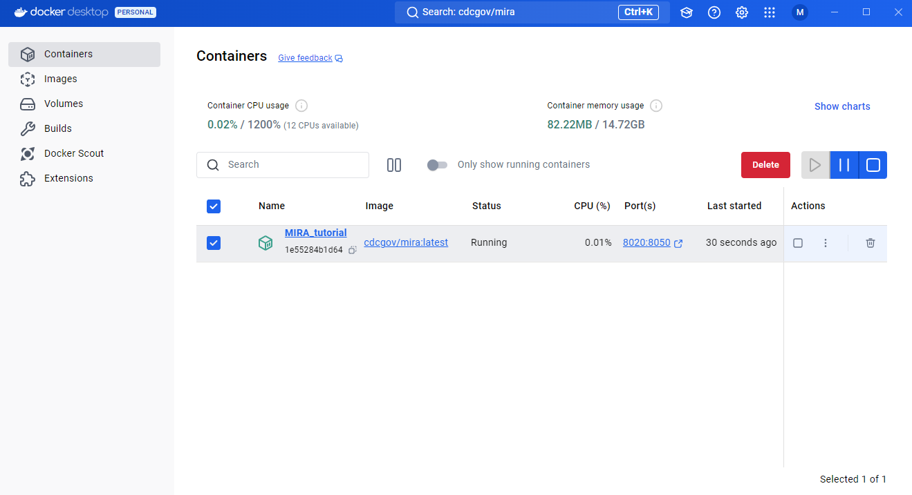
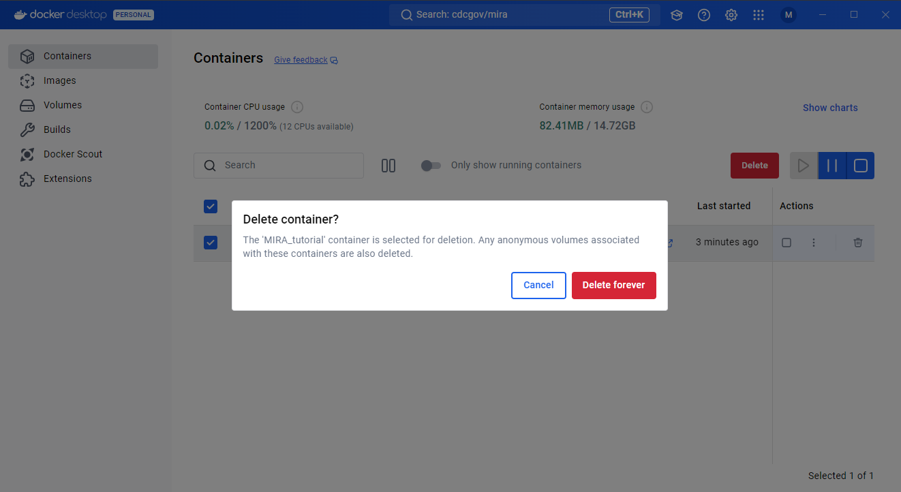
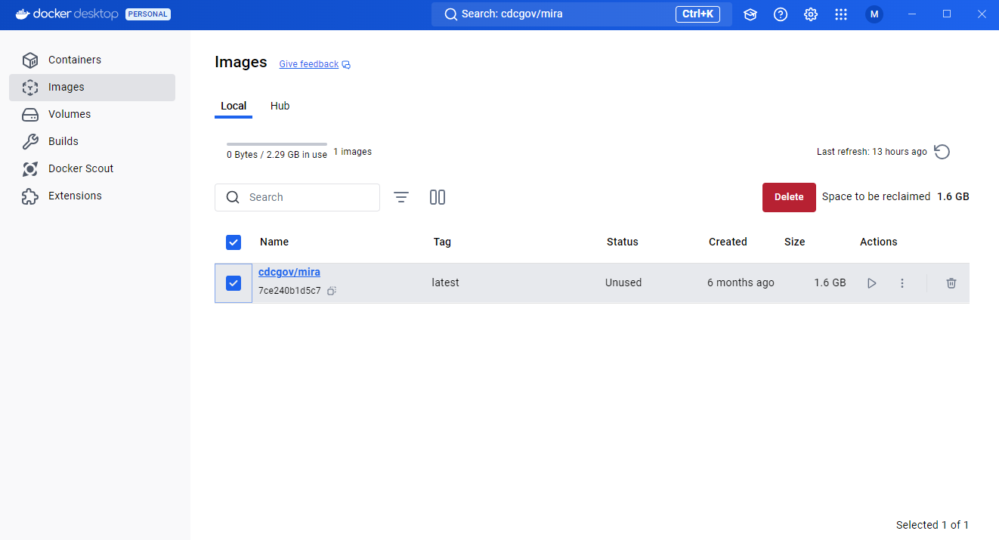
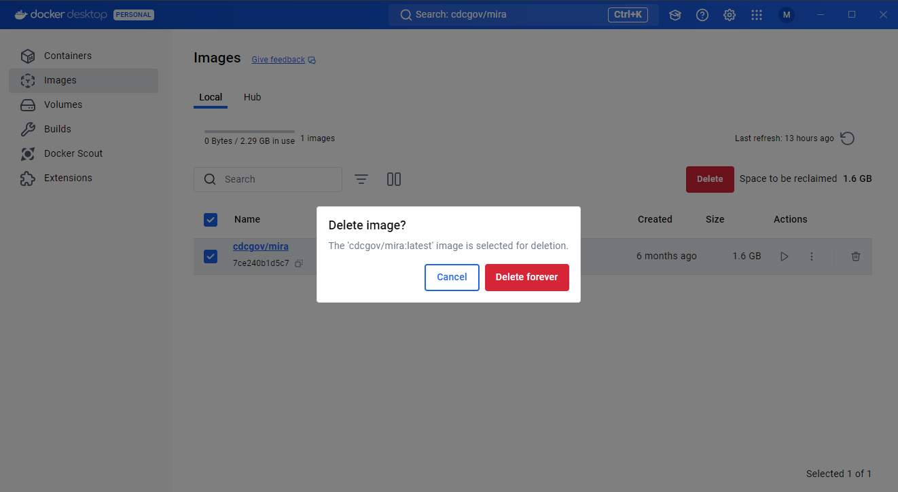
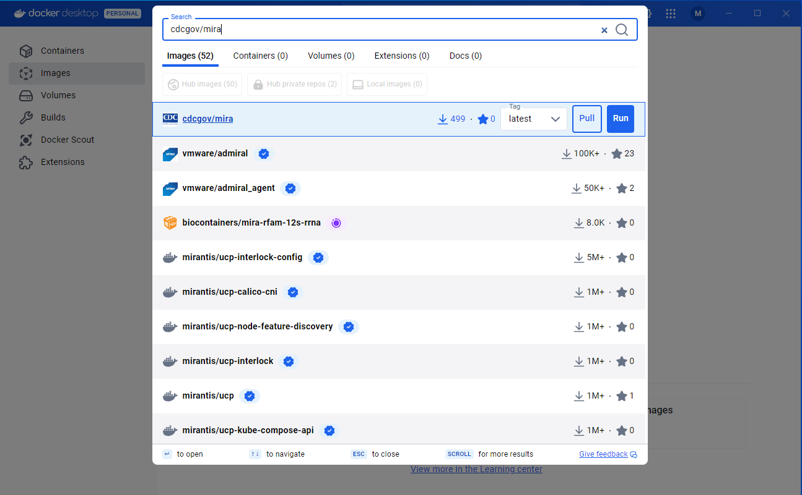
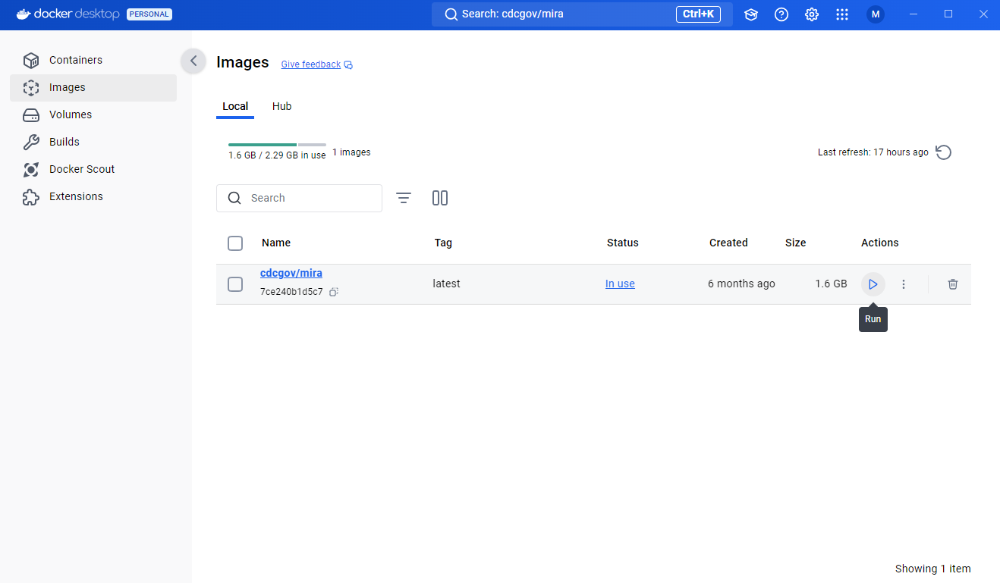
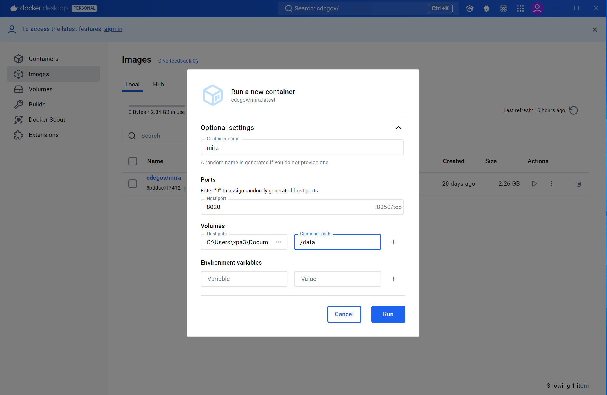
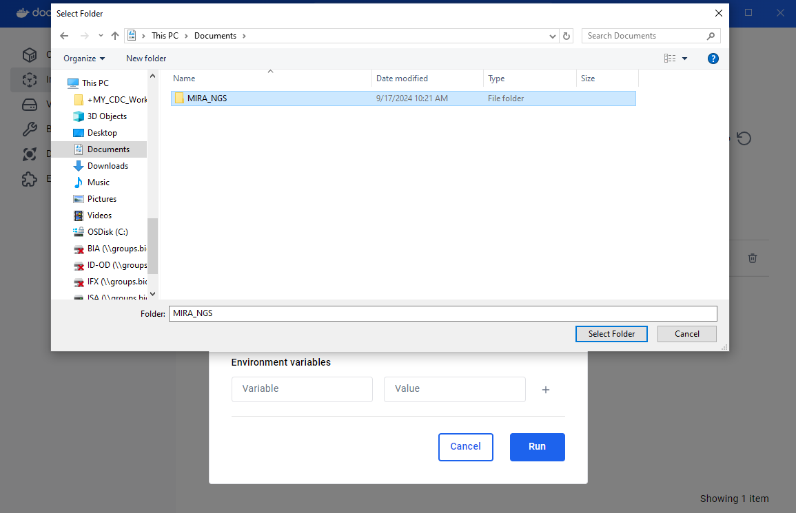
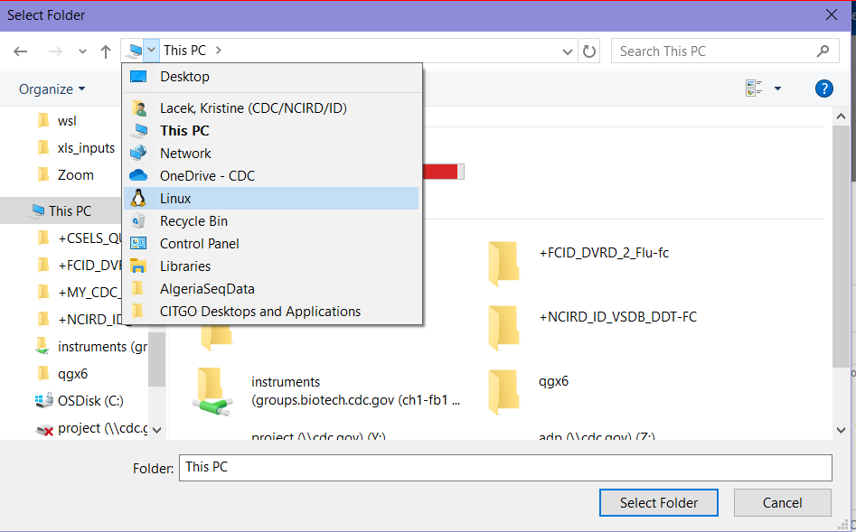

## How to upgrade MIRA to the latest version in Docker Desktop

1. Go to the containers tab in Docker Desktop and select all containers. Then press the stop button.

2. Then press delete. You will be asked to confirm that you want to delete the container.

3. Go to the images tab in Docker Desktop and select the MIRA image. Then press delete.

4. You will be asked to confirm that you want to delete the image.

5. Then re-pull the latest MIRA image :

## Pull MIRA Image within Docker Desktop

* In the search bar at the top of the Docker Desktop App type in cdcgov/mira. Once the image has come up, check that the tag is set to latest
and click the 'pull' button.

* MIRA's single image is about 2 GB and will take a couple of minutes to pull to the images area. Once docker has finished downloading the image, you should see it under your images tab. 

### Provide the Settings for the Container

* Open the 'Optional settings' section. The container settings should be filled out as seen in the screenshot below.

  

 * You will need to provide a name for the container. "MIRA" is the obvious choice!
 * Set the "Host Port" to 8020
 * Under Volumes click the "Host Path" box and find and select your existing "FLU_SC2_SEQUENCING" or "MIRA_NGS" folder.
  
 
 **If you would like your "Host Path" to be a folder within your linux environment, use the drop down in your file browser to find it. See the screenshot below for an example.** 
 
 
 
 * Under Volumes you will make the "Container Path" type in '/data'.

 * Click "Run"! MIRA container icon should turn green, then click the 8020:8050 hyperlink to open the MIRA applicaion
